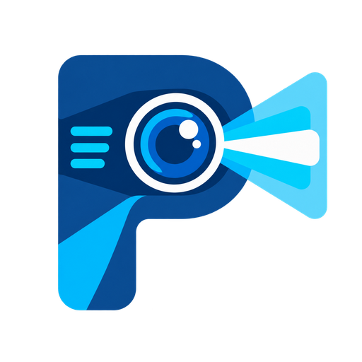

# Proyektor Next

  

**La Biblia en tu pantalla.**

Proyektor Next es una aplicación gratuita de escritorio para preparar y controlar presentaciones
bíblicas y multimedia en iglesias, reuniones y eventos. Abre directamente en la pantalla principal:
puedes usarla sin cuenta como **Invitado**. Este repositorio público contiene los instaladores,
notas de versión y archivos de actualizaciones automáticas; el código fuente no se distribuye aquí.

[Sitio de la aplicación](https://darntn.github.io/proyektor-next-releases/) ·
[Política de privacidad](https://darntn.github.io/proyektor-next-releases/privacidad.html) ·
[Términos de uso](https://darntn.github.io/proyektor-next-releases/terminos.html) ·
[Preguntas frecuentes](https://darntn.github.io/proyektor-next-releases/preguntas-frecuentes.html)

## Descargar

[Descargar la versión más reciente desde la página de Proyektor](https://darntn.github.io/proyektor-next-releases/)

El botón de la página consulta el último release y descarga directamente el archivo que termina en
`x64-setup.exe`, sin abrir la página del release. Los archivos `latest.json` y `.sig` son utilizados
automáticamente por la aplicación para comprobar y verificar actualizaciones.

## Características

- Consulta de Biblias instaladas, navegación por libro, capítulo y versículo.
- Concordancia y búsqueda de palabras o frases en las Escrituras.
- Gestión de cancioneros, letras, favoritos y presentación por estrofas.
- Biblioteca de fondos con imágenes, videos y recursos importados.
- Reproducción de videos, páginas web y contenido multimedia en el Visor.
- Notas, anuncios programados, reloj, cronómetro y cuenta regresiva.
- Ventana de presentación independiente con estilos, transiciones y control del contenido.
- Descarga de recursos bíblicos adicionales.
- Comprobación, descarga e instalación de actualizaciones firmadas.
- Vinculación opcional con Google o Microsoft para respaldar y recuperar datos cuando la instalación
  incluya la configuración OAuth del proveedor.

## Cuenta y respaldo opcionales

Al vincular una cuenta, Proyektor utiliza la carpeta privada de datos de la aplicación en Google Drive
o la carpeta de aplicación en OneDrive. Sincroniza mientras la aplicación está abierta y hay Internet.
Cuando hay cambios remotos distintos, permite elegir qué categorías importar y advierte si se
reemplazarán elementos locales equivalentes. Se respaldan configuraciones, Biblias y fondos
adicionales, cancioneros, notas, anuncios, lista de YouTube del Reproductor, Adicionales, favoritos y
fondo del Visor. La cuenta no es necesaria para usar las funciones locales.

Google solicita datos básicos del perfil y el permiso limitado `drive.appdata`, no acceso a los
documentos generales de Drive. Consulta la [política de privacidad](https://darntn.github.io/proyektor-next-releases/privacidad.html)
antes de vincular una cuenta.

## Requisitos

- Windows de 64 bits.
- Microsoft WebView2 actualizado.
- Conexión a Internet para descargar recursos o actualizaciones; las Biblias instaladas pueden
  utilizarse sin conexión. La vinculación y sincronización de cuenta también requieren Internet.

## Actualizaciones

Proyektor Next comprueba en segundo plano si existe una versión superior. Cuando hay una disponible,
muestra sus notas y permite descargarla e instalarla desde la aplicación. Las actualizaciones están
firmadas para verificar su integridad y conservan Biblias, cancioneros, fondos y datos existentes.

## Ayuda y privacidad del código

Para problemas o sugerencias, escribe a [proyektornext@gmail.com](mailto:proyektornext@gmail.com)
o abre una [incidencia](https://github.com/DarNtn/proyektor-next-releases/issues) sin publicar datos
personales ni secretos. Para solicitudes privadas relacionadas con tu cuenta, usa el correo de soporte.
Los archivos ZIP y TAR generados
automáticamente por GitHub contienen solamente la información pública de este repositorio.
